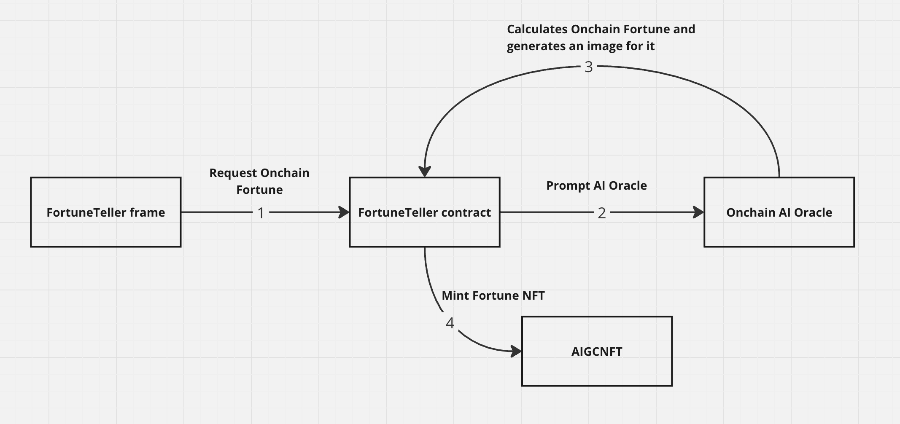

# FortuneTeller
FortuneTeller is a Farcaster frame application that calculates onchain fortune for the users. Users answer specific questions to the wizard. Then the wizard casts its spells and tells the fortune.

## Architecture
FortuneTeller frame uses [ORA's Onchain AI Oracle](https://docs.ora.io/doc/oao-onchain-ai-oracle/introduction) to generate Onchain Fortune for the users. 

1. Once the user answers all the questions, fortune request is generated and sent to the FortuneTeller contract
2. The request is passed to the Onchain AI Oracle
3. Onchain AI Oracle uses Llama3 model to generate fortune in a textual representation. This is then passed to StableDiffusion model in order to generate visual representation of the fortune.
4. Users can mint an AI generated NFT for their fortune.

## Technologies
### ORA's Onchain AI Oracle
By using Onchain AI Oracle, we can verify that the fortune is actually told by Llama3 AI model and that the image is generated by StableDiffusion.

ORA's Onchain AI Oracle uses [opML](https://docs.ora.io/doc/technology/proving-frameworks-zkml-opml-opp-ai/opml) technology to prove AI inference results.

### Farcaster protocol
Farcaster protocol enables interactive and fun experience for the users.

### Base Blockchain
FortuneTeller contracts are deployed on Base to allow fast and affordable blockchain transactions. FortuneTeller frame uses `@coinbase/onchainkit` to build frames with an ease.

## Local Setup

1. Run the development server: `yarn dev`
2. Use [ngrok](https://ngrok.com/) to expose your local frame 
3. Test the frame with https://warpcast.com/~/developers/frames

> If you don't want to use ngrok, you can test the frame using local debugger from [frames.js](https://framesjs.org/).

## Deployed contracts
**Base Deployment**

All the contracts are verified on the [blockscout](https://base.blockscout.com/) explorer.
- FortuneTeller.sol: [0x734Ce2D6E599f8bA401eC77d1fd41C9f57ECf491](https://base.blockscout.com/address/0x734Ce2D6E599f8bA401eC77d1fd41C9f57ECf491)
- AIGCNFT.sol: [0xa2Ab28f5CBAE53E316868B167872F1bC8Ab28c63](https://base.blockscout.com/address/0xa2Ab28f5CBAE53E316868B167872F1bC8Ab28c63)

## Video Demo

## Future Work
- Integrate ORA's rng oracle, to enable more random fortune telling
- create a dashboard for minted NFTs

## Learn More

For further readings check:

- [Onchain AI Oracle tutorial](https://docs.ora.io/doc/oao-onchain-ai-oracle/develop-guide/tutorials/interaction-with-oao-tutorial) - understand how to utilise verifiable AI in your dapps.
- [Farcaster docs](https://docs.farcaster.xyz/) - an interactive Next.js tutorial.
- [Base Onchain Kit](https://onchainkit.xyz/) - a framework that can help with building frames
